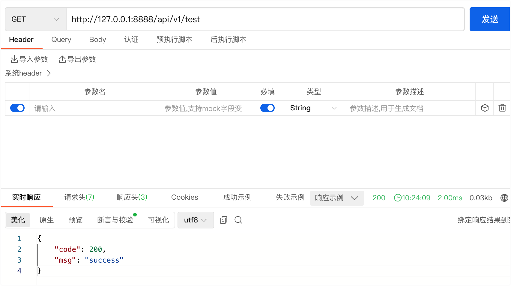
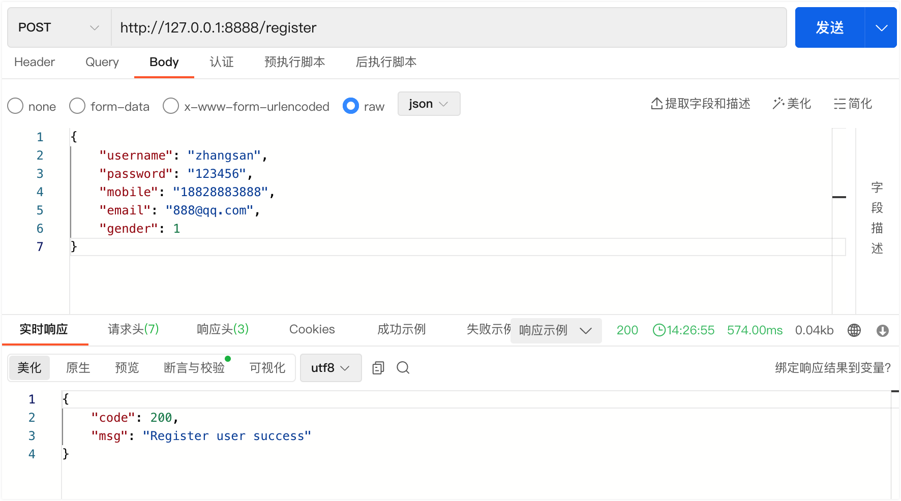
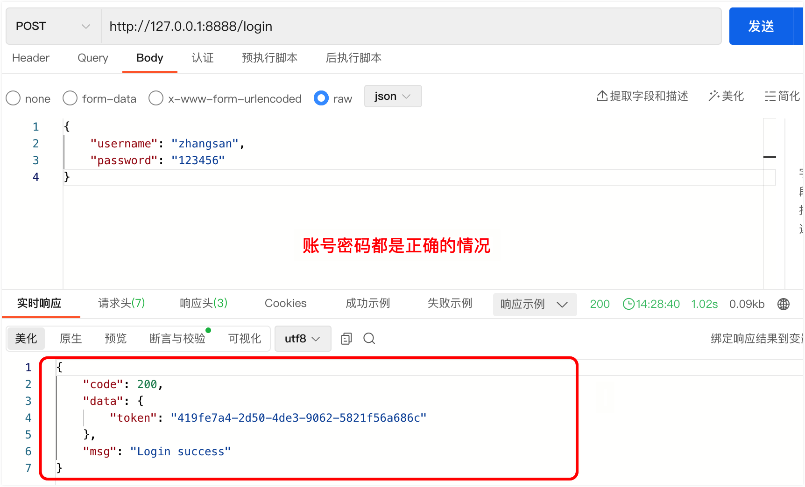
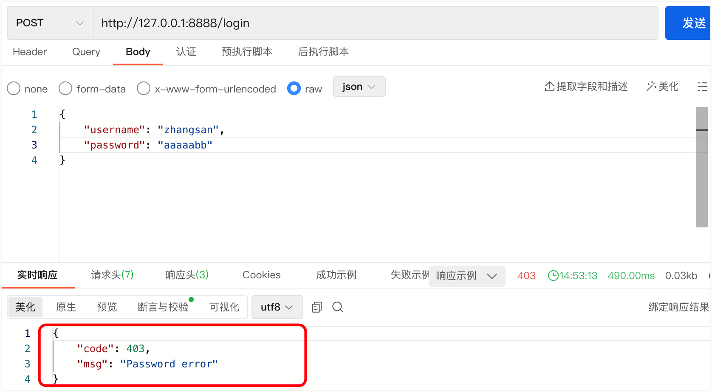
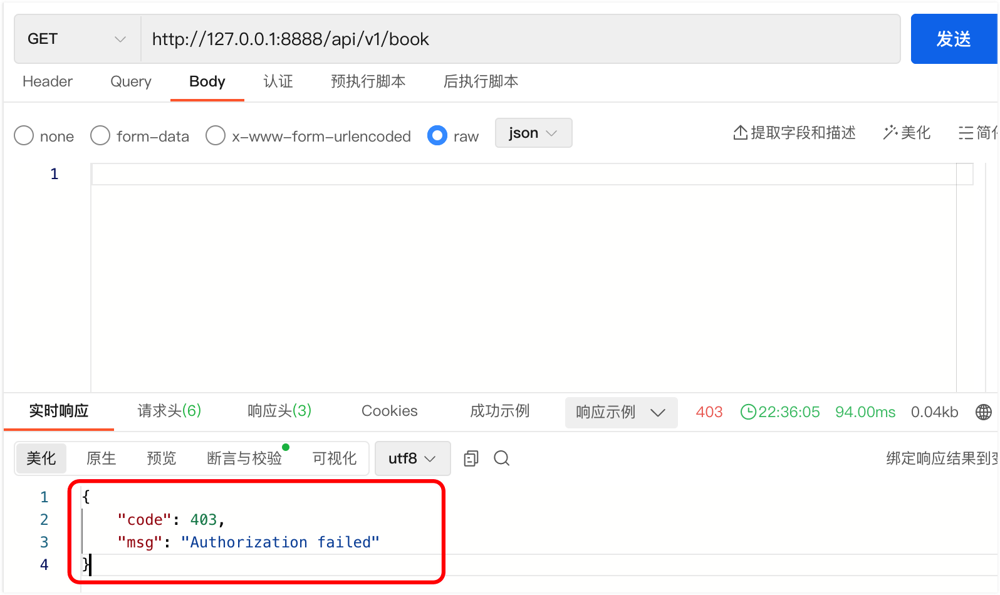
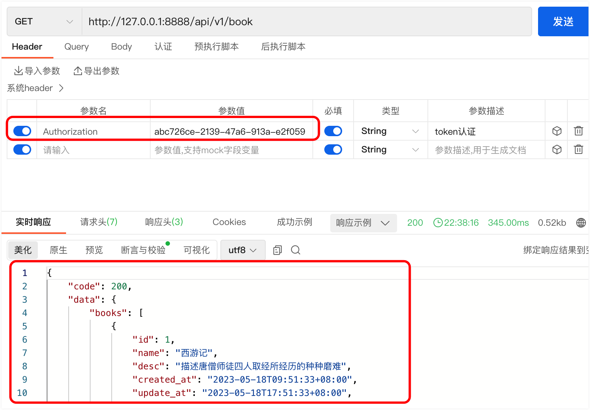

## 1 初始化项目环境

### 1.1 Go项目常用结构

```go
.
├── Readme.md // 项目说明（帮助你快速的属性和了解项目）
├── config // 配置文件（mysql配置 ip 端口 用户名 密码，不能写死到代码中）
├── controller // CLD：服务入口，负责处理路由、参数校验、请求转发
├── service // CLD：逻辑（服务）层，负责业务逻辑处理
├── dao // CLD：负责数据与存储相关功能（mysql、redis、ES等）
│   ├── mysql
├── model // 模型（定义表结构）
├── logging // 日志处理
├── main.go // 项目启动入口
├── middleware // 中间件
├── pkg // 公共服务（所有模块都能访问的服务）
├── router // 路由（路由分发）
```

### 1.2 创建数据库

```mysql
mysql> create database book_manage charset utf8;
```

### 1.3 当前项目结构

```bash
cd myBookManage

go mod init myBookManage
```

图书管理服务

- 用户服务：注册、登录
- 书籍服务：对书籍进行增删改查操作

用户可以拥有多本图书，一本书籍也可能有多个作者。即用户模型与书籍模型是多对多的一个关系。

```bash
.
├── controller       // CLD：服务入口，负责处理路由、参数校验、请求转发
│   ├── book.go
│   └── user.go
├── dao              // CLD：负责数据与存储相关功能（mysql、redis、ES等）
│   ├── mysql
│   │   └── mysql.go
│   └── redis
├── go.mod
├── go.sum
├── main.go          // 项目启动入口
├── middleware       // 中间件
│   └── auth.go      // token 认证
├── model            // 模型
│   ├── book.go
│   ├── user.go
│   └── user_m2m_book.go
├── pkg              // 公共服务（所有模块都能访问的服务）
│   └── bcrypt_check.go    // 密码加密及校验
├── router           // 路由
│   ├── api_router.go
│   ├── init_router.go
│   └── test_router.go
```

### 1.4 所使用包

```go
go get github.com/gin-gonic/gin 

go get gorm.io/gorm 

go get gorm.io/driver/mysql

go get github.com/google/uuid
```

## 2 添加路由分层

### 2.1 main.go

```go
package main

import "myBookManage/router"

func main() {
	// 初始化路由
	r := router.InitRouter()

	// 运行服务器，监听端口 ":8888"
	r.Run(":8888")
}
```

### 2.2 router/init_router.go

```go
package router

import "github.com/gin-gonic/gin"

// InitRouter 初始化路由并返回一个 *gin.Engine 实例
func InitRouter() *gin.Engine {
	r := gin.Default() // 创建默认的 Gin 引擎实例
	TestRouters(r)     // 注册测试路由
	return r           // 返回初始化后的 Gin 引擎实例
}
```

### 2.3 router/test_router.go

```go
package router

import (
	"github.com/gin-gonic/gin"
	"net/http"
)

// TestRouters 注册测试路由
func TestRouters(r *gin.Engine) {
	v1 := r.Group("/api/v1") // 创建名为 "/api/v1" 的路由组

	// 注册 GET 请求处理函数 "/api/v1/test"
	v1.GET("/test", TestHandler)
}

// TestHandler 处理测试请求的处理函数
func TestHandler(c *gin.Context) {
	// 返回 JSON 响应，状态码为 http.StatusOK (200)，响应内容为 {"code": 200, "msg": "success"}
	c.JSON(http.StatusOK, gin.H{"code": 200, "msg": "success"})
}
```

### 2.4 访问测试



## 3 初始化mysql连接

### 3.1 main.go

```go
package main

import (
	"myBookManage/dao/mysql"
	"myBookManage/router"
)

func main() {
	// 初始化mysql连接
	mysql.InitMysql()

	//	初始化路由
	r := router.InitRouter()

	// 运行服务器，监听端口 ":8888"
	r.Run(":8888")
}
```

### 3.2 dao/mysql/mysql.go

```go
package mysql

import (
	gmysql "gorm.io/driver/mysql"
	"gorm.io/gorm"
)

var DB *gorm.DB

// InitMysql 初始化 MySQL 数据库连接
func InitMysql() {
	// 定义数据库连接字符串
	dsn := "root:admin123@tcp(124.71.33.240:3306)/book_manage?charset=utf8mb4&parseTime=True&loc=Local"
	// 打开数据库连接
	db, err := gorm.Open(gmysql.Open(dsn), &gorm.Config{})
	if err != nil {
		panic(err)
	}
	// 将数据库连接赋值给全局变量
	DB = db
}
```

## 4 定义多对多表结构

### 4.1 model/user.go

```go
package model

import "time"

type User struct {
	UID       int64     `gorm:"primary_key" json:"uid"`                                                                 // 用户ID，主键
	Username  string    `gorm:"not null; type:varchar(128); unique" json:"username" binding:"required"`                 // 用户名，非空、唯一
	Password  string    `gorm:"not null; type:varchar(128)" json:"password" binding:"required"`                         // 密码，非空
	Mobile    string    `gorm:"unique; type:varchar(32)" json:"mobile"`                                                 // 手机号，唯一
	Email     string    `gorm:"unique; type:varchar(32)" json:"email"`                                                  // 邮箱，唯一
	Gender    int64     `json:"gender"`                                                                                 // 性别，0表示男 1表示女
	CreatedAt time.Time `gorm:"type:TIMESTAMP;default:CURRENT_TIMESTAMP;<-:create" json:"created_at"`                   // 创建时间，使用当前时间作为默认值，仅在创建时设置
	UpdateAt  time.Time `gorm:"type:TIMESTAMP;default:CURRENT_TIMESTAMP  on update current_timestamp" json:"update_at"` // 更新时间，使用当前时间作为默认值，并在更新时自动更新
	Token     string    `gorm:"type:varchar(128)" json:"token"`                                                         // token
	Books     []Book    `gorm:"many2many:book_users"`                                                                   // 与书籍之间的多对多关系
}

func (User) TableName() string {
	return "user" // 指定表名为 "user"
}
```

### 4.2 model/book.go

```go
package model

import "time"

type Book struct {
	ID        int64     `gorm:"primary_key" json:"id"`                                                                  // 书籍ID，主键
	Name      string    `gorm:"not null; type:varchar(128); unique" json:"name" binding:"required"`                     // 书籍名称，非空、唯一
	Desc      string    `gorm:"type:varchar(256)" json:"desc"`                                                          // 书籍描述
	CreatedAt time.Time `gorm:"type:TIMESTAMP;default:CURRENT_TIMESTAMP;<-:create" json:"created_at"`                   // 创建时间，使用当前时间作为默认值，仅在创建时设置
	UpdatedAt time.Time `gorm:"type:TIMESTAMP;default:CURRENT_TIMESTAMP  on update current_timestamp" json:"update_at"` // 更新时间，使用当前时间作为默认值，并在更新时自动更新
	Users     []User    `gorm:"many2many:book_users"`                                                                   // 与用户之间的多对多关系
}

func (Book) TableName() string {
	return "book" // 指定表名为 "book"
}
```

### 4.3 model/user_m2m_book.go

```go
package model

type BookUser struct {
	ID      uint64 `gorm:"primaryKey"`         // 连接表的唯一标识符，作为主键
	UserUID uint64 `gorm:"primaryKey"`         // 用户的唯一标识符
	BookID  uint64 `gorm:"primaryKey"`         // 书籍的唯一标识符
	User    User   `gorm:"foreignKey:UserUID"` // 外键关联到 User 模型的 UserUID 字段
	Book    Book   `gorm:"foreignKey:BookID"`  // 外键关联到 Book 模型的 BookID 字段
}

func (BookUser) TableName() string {
	return "book_users" // 指定表名为 "book_users"
}
```

### 4.4 自动生成表结构

`dao/mysql/mysql.go`

```go
package mysql

import (
	gmysql "gorm.io/driver/mysql"
	"gorm.io/gorm"
	"myBookManage/model"
)

var DB *gorm.DB

// InitMysql 初始化 MySQL 数据库连接
func InitMysql() {
	// 定义数据库连接字符串
	dsn := "root:admin123@tcp(124.71.33.240:3306)/book_manage?charset=utf8mb4&parseTime=True&loc=Local"
	// 打开数据库连接
	db, err := gorm.Open(gmysql.Open(dsn), &gorm.Config{})
	if err != nil {
		panic(err)
	}
	// 将数据库连接赋值给全局变量
	DB = db

	//	自动创建表结构
	if err := DB.AutoMigrate(&model.User{}, &model.Book{}, &model.BookUser{}); err != nil {
		panic(err)
	}
}
```

### 4.5 验证测试

重新运行该项目，验证数据库中是否自动生成相关的三张表，以及表关系。

```mysql
mysql> use book_manage;
Database changed
mysql> show tables;
+-----------------------+
| Tables_in_book_manage |
+-----------------------+
| book                  |
| book_users            |
| user                  |
+-----------------------+
3 rows in set (0.01 sec)

mysql> desc book;
+------------+--------------+------+-----+-------------------+-----------------------------------------------+
| Field      | Type         | Null | Key | Default           | Extra                                         |
+------------+--------------+------+-----+-------------------+-----------------------------------------------+
| id         | bigint       | NO   | PRI | NULL              | auto_increment                                |
| name       | varchar(128) | NO   | UNI | NULL              |                                               |
| desc       | varchar(256) | YES  |     | NULL              |                                               |
| created_at | timestamp    | YES  |     | CURRENT_TIMESTAMP | DEFAULT_GENERATED                             |
| updated_at | timestamp    | YES  |     | CURRENT_TIMESTAMP | DEFAULT_GENERATED on update CURRENT_TIMESTAMP |
+------------+--------------+------+-----+-------------------+-----------------------------------------------+
5 rows in set (0.06 sec)

mysql> desc user;
+------------+--------------+------+-----+-------------------+-----------------------------------------------+
| Field      | Type         | Null | Key | Default           | Extra                                         |
+------------+--------------+------+-----+-------------------+-----------------------------------------------+
| uid        | bigint       | NO   | PRI | NULL              | auto_increment                                |
| username   | varchar(128) | NO   | UNI | NULL              |                                               |
| password   | varchar(128) | NO   |     | NULL              |                                               |
| mobile     | varchar(32)  | YES  | UNI | NULL              |                                               |
| email      | varchar(32)  | YES  | UNI | NULL              |                                               |
| gender     | bigint       | YES  |     | NULL              |                                               |
| created_at | timestamp    | YES  |     | CURRENT_TIMESTAMP | DEFAULT_GENERATED                             |
| update_at  | timestamp    | YES  |     | CURRENT_TIMESTAMP | DEFAULT_GENERATED on update CURRENT_TIMESTAMP |
| token      | varchar(128) | YES  |     | NULL              |                                               |
+------------+--------------+------+-----+-------------------+-----------------------------------------------+
9 rows in set (0.11 sec)

mysql> desc book_users;
+---------+-----------------+------+-----+---------+----------------+
| Field   | Type            | Null | Key | Default | Extra          |
+---------+-----------------+------+-----+---------+----------------+
| id      | bigint unsigned | NO   | PRI | NULL    | auto_increment |
| user_id | bigint          | NO   | PRI | NULL    |                |
| book_id | bigint          | NO   | PRI | NULL    |                |
+---------+-----------------+------+-----+---------+----------------+
3 rows in set (0.00 sec)

mysql> show create table book_users;
+------------+------------+
| Table      | Create Table                                                                                                     +------------+------------+
| book_users | CREATE TABLE `book_users` (
  `id` bigint unsigned NOT NULL AUTO_INCREMENT,
  `user_id` bigint NOT NULL,
  `book_id` bigint NOT NULL,
  PRIMARY KEY (`id`,`user_id`,`book_id`),
  KEY `fk_book_users_user` (`user_id`),
  KEY `fk_book_users_book` (`book_id`),
  CONSTRAINT `fk_book_users_book` FOREIGN KEY (`book_id`) REFERENCES `book` (`id`),
  CONSTRAINT `fk_book_users_user` FOREIGN KEY (`user_id`) REFERENCES `user` (`uid`)
) ENGINE=InnoDB DEFAULT CHARSET=utf8mb3 |
+------------+------------+
1 row in set (0.00 sec)

mysql> 
```

## 5 注册登录

### 5.1 router/init_router.go

```go
package router

import "github.com/gin-gonic/gin"

// InitRouter 初始化路由并返回一个 *gin.Engine 实例
func InitRouter() *gin.Engine {
	r := gin.Default() // 创建默认的 Gin 引擎实例
	TestRouters(r)     // 注册测试路由
	SetupApiRouters(r) // 注册 API 路由
	return r           // 返回初始化后的 Gin 引擎实例
}
```

### 5.2 router/api_router.go

```go
package router

import (
	"github.com/gin-gonic/gin"
	"myBookManage/controller"
)

// SetupApiRouters 设置 API 路由
func SetupApiRouters(r *gin.Engine) {
	r.POST("/register", controller.RegisterHandler) // 注册用户的路由
	r.POST("/login", controller.LoginHandler)       // 用户登录的路由
}
```

### 5.3 pkg/bcrypt_check.go

```go
package pkg

import "golang.org/x/crypto/bcrypt"

// HashPassword 生成密码的哈希值
// 使用 bcrypt 算法将原始密码进行哈希，并返回哈希值的字符串表示和可能的错误
func HashPassword(password string) (string, error) {
	bytes, err := bcrypt.GenerateFromPassword([]byte(password), 12)
	return string(bytes), err
}

// CheckPasswordHash 验证密码的哈希值
// 使用 bcrypt 算法将原始密码与哈希值进行比较，判断密码是否匹配
// 如果密码匹配，则返回 true，否则返回 false
func CheckPasswordHash(hash, password string) bool {
	err := bcrypt.CompareHashAndPassword([]byte(hash), []byte(password))
	return err == nil
}
```

### 5.4 model/user.go

更新 `user` 模型，添加 `BeforeCreate`  钩子函数，对密码进行加密

```go
package model

import (
	"gorm.io/gorm"
	"myBookManage/pkg"
	"time"
)

type User struct {
	UID       int64     `gorm:"primary_key" json:"uid"`                                                                 // 用户ID，主键
	Username  string    `gorm:"not null; type:varchar(128); unique" json:"username" binding:"required"`                 // 用户名，非空、唯一
	Password  string    `gorm:"not null; type:varchar(128)" json:"password" binding:"required"`                         // 密码，非空
	Mobile    string    `gorm:"unique; type:varchar(32)" json:"mobile"`                                                 // 手机号，唯一
	Email     string    `gorm:"unique; type:varchar(32)" json:"email"`                                                  // 邮箱，唯一
	Gender    int64     `json:"gender"`                                                                                 // 性别，0表示男 1表示女
	CreatedAt time.Time `gorm:"type:TIMESTAMP;default:CURRENT_TIMESTAMP;<-:create" json:"created_at"`                   // 创建时间，使用当前时间作为默认值，仅在创建时设置
	UpdateAt  time.Time `gorm:"type:TIMESTAMP;default:CURRENT_TIMESTAMP  on update current_timestamp" json:"update_at"` // 更新时间，使用当前时间作为默认值，并在更新时自动更新
	Token     string    `gorm:"type:varchar(128)" json:"token"`                                                         // token
	Books     []Book    `gorm:"many2many:book_users"`                                                                   // 与书籍之间的多对多关系
}

func (User) TableName() string {
	return "user" // 指定表名为 "user"
}

// BeforeCreate 利用GORM的钩子函数，往数据库中存入数据的时候，进行加密处理
func (u *User) BeforeCreate(tx *gorm.DB) (err error) {
	bcryptPW, err := pkg.HashPassword(u.Password) // 使用密码哈希函数对用户密码进行哈希处理
	if err != nil {
		return err // 如果密码哈希处理出现错误，则直接返回错误
	}
	u.Password = bcryptPW // 将哈希后的密码赋值给用户密码字段
	return nil            // 返回 nil 表示没有错误发生
}
```

### 5.5 controller/user.go

用户注册、登录等逻辑实现。

```go
package controller

import (
	"github.com/gin-gonic/gin"
	"github.com/google/uuid"
	"myBookManage/dao/mysql"
	"myBookManage/model"
	"myBookManage/pkg"
	"net/http"
)

// RegisterHandler 处理用户注册请求
func RegisterHandler(c *gin.Context) {
	p := new(model.User)
	if err := c.ShouldBindJSON(p); err != nil {
		c.JSON(http.StatusBadRequest, gin.H{
			"code": 400,
			"msg":  err.Error(),
		})
		return
	}
	mysql.DB.Create(&p) // 创建用户记录

	c.JSON(http.StatusOK, gin.H{
		"code": 200,
		"msg":  "Register user success",
	})
}

// LoginHandler 处理用户登录请求
func LoginHandler(c *gin.Context) {
	p := new(model.User)
	if err := c.ShouldBindJSON(p); err != nil {
		c.JSON(http.StatusBadRequest, gin.H{
			"code": 400,
			"msg":  err.Error(),
		})
		return
	}
  
	// 去数据库中查找该用户，如果存在，则继续进行下面的密码验证
	u := model.User{Username: p.Username}
	if rows := mysql.DB.Where(&u).First(&u).Row(); rows == nil {
		c.JSON(http.StatusBadRequest, gin.H{
			"code": 400,
			"msg":  "user does not exist",
		})
		return
	}

	// 对密码进行校验
	if !pkg.CheckPasswordHash(u.Password, p.Password) {
		c.JSON(http.StatusUnauthorized, gin.H{
			"code": 401,
			"msg":  "Password error",
		})
		return
	}
  
	token := uuid.New().String()              // 生成新的token
	mysql.DB.Model(&u).Update("token", token) // 更新用户的令牌字段
	c.JSON(http.StatusOK, gin.H{
		"code": 200,
		"msg":  "Login success",
		"data": gin.H{"token": token},
	})
}
```

### 5.6 测试注册功能

- POST：http://127.0.0.1:8888/register

- 请求参数：

```json
{
    "username": "zhangsan",
    "password": "123456",
    "mobile": "18828883888",
    "email": "888@qq.com",
    "gender": 1
}
```

- ApiPost测试



### 5.7 测试登录功能

- POST：http://127.0.0.1:8888/login

- 请求参数：

```json
{
    "username": "zhangsan",
    "password": "123456",
    "mobile": "18828883888",
    "email": "888@qq.com",
    "gender": 1
}
```

- ApiPost测试



不存在的用户:


密码错误的情况：



## 6 图书管理

### 6.1 router/api_router.go

```go
package router

import (
	"github.com/gin-gonic/gin"
	"myBookManage/controller"
)

// SetupApiRouters 设置 API 路由
func SetupApiRouters(r *gin.Engine) {
	r.POST("/register", controller.RegisterHandler) // 注册用户的路由
	r.POST("/login", controller.LoginHandler)       // 用户登录的路由

	v1 := r.Group("/api/v1")

	v1.POST("book", controller.CreateBookHandler)       // 创建书籍的路由
	v1.GET("book", controller.GetBookListHandler)       // 获取书籍列表的路由
	v1.GET("book/:id", controller.GetBookDetailHandler) // 获取单个书籍详情的路由
	v1.PUT("book", controller.UpdateBookHandler)        // 更新书籍信息的路由
	v1.DELETE("book/:id", controller.DeleteBookHandler) // 删除书籍的路由
}
```

### 6.2 controller/book.go

```go
package controller

import (
	"github.com/gin-gonic/gin"
	"myBookManage/dao/mysql"
	"myBookManage/model"
	"net/http"
	"strconv"
)

// CreateBookHandler 处理创建书籍的请求
func CreateBookHandler(c *gin.Context) {
	p := new(model.Book)
	if err := c.ShouldBindJSON(&p); err != nil {
		c.JSON(http.StatusBadRequest, gin.H{
			"code": 400,
			"msg":  err.Error(),
		})
		return
	}

	// 判断是否有传入用户
	if len(p.Users) == 0 {
		c.JSON(http.StatusBadRequest, gin.H{
			"code": 400,
			"msg":  "missing parameter for users",
		})
		return
	}

	// 如果有用户，需判断用户是否已存在（这里不做复杂的用户校验，就是只是判断传入的用户是否存在，如果不存在，则不允许创建书籍）
	var users []model.User
	existingUsers := make(map[int64]struct{}) // 用来校验是否添加到users中
	for _, v := range p.Users {
		var user model.User
		if rows := mysql.DB.Debug().Where("username = ?", v.Username).Or("uid = ?", v.UID).First(&user).Row(); rows != nil {
			// 如果传入的用户存在，则将这个用户记录添加到 users 切片中
			// 首先判断 users 切片中是否已经存在该用户了，如果存在则不添加
			if _, ok := existingUsers[user.UID]; !ok {
				users = append(users, user)
				existingUsers[user.UID] = struct{}{}
			}
		}
	}

	// 添加书籍
	book := model.Book{
		Name: p.Name,
		Desc: p.Desc,
	}
	mysql.DB.Create(&book)

	// 为用户和书籍添加关联关系
	mysql.DB.Model(&book).Association("Users").Append(users)
	c.JSON(http.StatusOK, gin.H{"code": 200, "msg": "Add book success"})
}

// GetBookListHandler 处理获取所有书籍及其关联用户的请求
func GetBookListHandler(c *gin.Context) {
	books := []model.Book{}
	// 查看所有书籍，及其相关的用户
	mysql.DB.Preload("Users").Find(&books)
	c.JSON(http.StatusOK, gin.H{
		"code": 200,
		"msg":  "success",
		"data": gin.H{
			"books": books,
		},
	})
}

// GetBookDetailHandler 查看指定的书籍
func GetBookDetailHandler(c *gin.Context) {
	pipelineIdStr := c.Param("id") // 获取URL参数
	bookID, _ := strconv.ParseInt(pipelineIdStr, 10, 64)
	book := model.Book{ID: bookID}
	// 查询书籍，及其关联的用户
	mysql.DB.Preload("Users").Find(&book)
	c.JSON(http.StatusOK, gin.H{
		"code": 200,
		"msg":  "success",
		"data": gin.H{
			"book": book,
		},
	})
}

// UpdateBookHandler 修改书籍信息
func UpdateBookHandler(c *gin.Context) {
	p := new(model.Book)
	if err := c.ShouldBindJSON(&p); err != nil {
		c.JSON(http.StatusBadRequest, gin.H{
			"code": 400,
			"msg":  err.Error(),
		})
		return
	}

	//	判断传入的书籍是否存在，如果存在则进行修改相关的操作
	oldBook := model.Book{ID: p.ID}
	if rows := mysql.DB.Debug().Where(&oldBook).First(&oldBook).Row(); rows != nil {
		var newBook model.Book
		if p.Name != "" {
			newBook.Name = p.Name
		}
		if p.Desc != "" {
			newBook.Desc = p.Desc
		}

		// 判断是否有传入用户信息，如果传入了用户，则还要修改书籍表和用户的关系
		if len(p.Users) != 0 {
			// 首先获取用户传入的用户信息是否存在。
			var users []model.User
			existingUsers := make(map[int64]struct{}) // 用来校验是否添加到users中
			for _, v := range p.Users {
				var user model.User
				if rows := mysql.DB.Debug().Where("username = ?", v.Username).Or("uid = ?", v.UID).First(&user).Row(); rows != nil {
					// 如果传入的用户存在，则将这个用户记录添加到 users 切片中
					// 首先判断 users 切片中是否已经存在该用户了，如果存在则不添加
					if _, ok := existingUsers[user.UID]; !ok {
						users = append(users, user)
						existingUsers[user.UID] = struct{}{}
					}
				} else {
					//	如果传入的用户再数据库中没有找到，那么不允许更新。因为参数错误
					c.JSON(http.StatusNotFound, gin.H{"code": 404, "msg": "user does not exist"})
					return
				}
			}
			// 修改书籍信息
			mysql.DB.Model(&oldBook).Updates(newBook)
			// 修改书籍和用户之间的绑定关系
			// 这里用 Replace 替换测试过，没有效果，所以使用下面的删除关联，然后再添加关联。
			//mysql.DB.Debug().Model(&oldBook).Association("Users").Replace(users)
			// 先删除之前的关联，然后重新关联
			mysql.DB.Debug().Model(&oldBook).Association("Users").Clear()
			mysql.DB.Model(&oldBook).Association("Users").Append(users)
		} else {
			// 如果没有传入用户细腻些，只是修改修改书籍信息
			mysql.DB.Model(&oldBook).Updates(newBook)
		}
		c.JSON(http.StatusOK, gin.H{"code": 200, "msg": "update book success"})
	} else {
		c.JSON(http.StatusNotFound, gin.H{"code": 404, "msg": "book does not exist"})
	}
}

// DeleteBookHandler 删除书籍信息
func DeleteBookHandler(c *gin.Context) {
	pipelineIdStr := c.Param("id") // 获取URL参数
	bookID, _ := strconv.ParseInt(pipelineIdStr, 10, 64)
	// 删除book时，同时删除第三张表中的关联信息，也就是与用户对应关系记录
	mysql.DB.Debug().Select("Users").Delete(&model.Book{ID: bookID})
	c.JSON(http.StatusOK, gin.H{
		"code": 200,
		"msg":  "success",
	})
}
```

### 6.3 创建书籍

- POST：http://127.0.0.1:8888/api/v1/book

- 请求参数：

```json
{
    "name": "红楼梦",
    "desc": "红楼梦，后宫的故事",
    "users": [
        {"username": "zhangsan"},
    ]
}
```

- 响应结果

```json
{
	"code": 200,
	"msg": "Add book success"
}
```

### 6.4 查看图书列表

- GET：http://127.0.0.1:8888/api/v1/book

- 请求参数：无

- 响应结果

```json
{
	"code": 200,
	"data": {
		"books": [
			{
				"id": 1,
				"name": "西游记",
				"desc": "描述唐僧师徒四人取经所经历的种种磨难",
				"created_at": "2023-05-18T09:51:33+08:00",
				"update_at": "2023-05-18T17:51:33+08:00",
				"Users": [
					{
						"uid": 1,
						"username": "zhangsan",
						"password": "$2a$12$VNDLUB49JpNtfsXXvu4EQOkkAgPvUb2dZFKFbjWcBxSqjomgC8cui",
						"mobile": "18828883888",
						"email": "888@qq.com",
						"gender": 1,
						"created_at": "2023-05-18T09:51:01+08:00",
						"update_at": "2023-05-18T09:51:01+08:00",
						"token": "",
						"Books": null
					}
				]
			},
			{
				"id": 2,
				"name": "红楼梦",
				"desc": "红楼梦，后宫的故事",
				"created_at": "2023-05-18T10:34:19+08:00",
				"update_at": "2023-05-18T18:34:20+08:00",
				"Users": [
					{
						"uid": 1,
						"username": "zhangsan",
						"password": "$2a$12$VNDLUB49JpNtfsXXvu4EQOkkAgPvUb2dZFKFbjWcBxSqjomgC8cui",
						"mobile": "18828883888",
						"email": "888@qq.com",
						"gender": 1,
						"created_at": "2023-05-18T09:51:01+08:00",
						"update_at": "2023-05-18T09:51:01+08:00",
						"token": "",
						"Books": null
					}
				]
			}
		]
	},
	"msg": "success"
}
```

### 6.5 查看图书详情

- GET：http://127.0.0.1:8888/api/v1/book/2

- 请求参数：API传参数（书籍ID）

- 响应结果

```json
{
	"code": 200,
	"data": {
		"book": {
			"id": 2,
			"name": "红楼梦",
			"desc": "红楼梦，后宫的故事",
			"created_at": "2023-05-18T10:34:19+08:00",
			"update_at": "2023-05-18T18:34:20+08:00",
			"Users": [
				{
					"uid": 1,
					"username": "zhangsan",
					"password": "$2a$12$VNDLUB49JpNtfsXXvu4EQOkkAgPvUb2dZFKFbjWcBxSqjomgC8cui",
					"mobile": "18828883888",
					"email": "888@qq.com",
					"gender": 1,
					"created_at": "2023-05-18T09:51:01+08:00",
					"update_at": "2023-05-18T09:51:01+08:00",
					"token": "",
					"Books": null
				}
			]
		}
	},
	"msg": "success"
}
```

### 6.6 修改图书信息

- PUT：http://127.0.0.1:8888/api/v1/book

- 请求参数：

```json
{
    "id": 2,
    "name": "红楼梦67",
    "desc": "红楼梦红楼梦红楼梦红楼梦红楼梦红楼......",
    "users":[
        {"username": "zhangsan"},
    ]
}
```

- 响应结果

```json
{
	"code": 200,
	"msg": "update book success"
}
```

### 6.7 删除图书信息

- DELETE：http://127.0.0.1:8888/api/v1/book/2

- 请求参数：API传参数（书籍ID）

- 响应结果

```json
{
	"code": 200,
	"msg": "success"
}
```

## 7 中间件身份认证

### 7.1 middleware/auth.go

```go
package middleware

import (
	"fmt"
	"github.com/gin-gonic/gin"
	"myBookManage/dao/mysql"
	"myBookManage/model"
	"net/http"
)

func AuthMiddleware() func(c *gin.Context) {
	// 客户端携带Token有三种方式 1.放在请求头 2.放在请求体 3.放在URI
	// token验证成功，返回c.Next继续，否则返回c.Abort()直接返回
	return func(c *gin.Context) {
		token := c.Request.Header.Get("Authorization")
		var u model.User
		//	如果没有当前用户
		fmt.Println("token")
		// created_at != update_at 查询语句加上这个，是为了避免注册了的用户从未登录过token也为空的情况。 因为一旦登录过，那么就会生成token，那么update_at就会发生变换
		if rows := mysql.DB.Debug().Where("token = ? AND created_at != update_at", token).First(&u).RowsAffected; rows != 1 {
			fmt.Println("来了")
			c.JSON(http.StatusForbidden, gin.H{"code": 403, "msg": "Authorization failed"})
			c.Abort()
			return
		}
		fmt.Println("没来")
		//	将当前请求的userID信息保存到请求的上下午c上
		c.Set("UserId", u.UID)
		c.Next()
	}
}
```

### 7.2 router/api_router.go

```go
package router

import (
	"github.com/gin-gonic/gin"
	"myBookManage/controller"
	"myBookManage/middleware"
)

// SetupApiRouters 设置 API 路由
func SetupApiRouters(r *gin.Engine) {
	r.POST("/register", controller.RegisterHandler) // 注册用户的路由
	r.POST("/login", controller.LoginHandler)       // 用户登录的路由

	v1 := r.Group("/api/v1")
	v1.Use(middleware.AuthMiddleware()) // 给v1这个路由组注册auth中间件

	v1.POST("book", controller.CreateBookHandler)       // 创建书籍的路由
	v1.GET("book", controller.GetBookListHandler)       // 获取书籍列表的路由
	v1.GET("book/:id", controller.GetBookDetailHandler) // 获取单个书籍详情的路由
	v1.PUT("book", controller.UpdateBookHandler)        // 更新书籍信息的路由
	v1.DELETE("book/:id", controller.DeleteBookHandler) // 删除书籍的路由
}
```

### 7.3 测试登录功能

- POST：http://127.0.0.1:8888/login

- 请求参数：

```json
{
    "username": "zhangsan",
    "password": "123456"
}
```

- 响应结果

```json
{
	"code": 200,
	"data": {
		"token": "abc726ce-2139-47a6-913a-e2f059372e75"
	},
	"msg": "Login success"
}
```

### 7.4 测试无token获取图书列表

- GET：http://127.0.0.1:8888/api/v1/book



### 7.5 携带token测试

在请求头添加认证信息

- GET：http://127.0.0.1:8888/api/v1/book
- Authorization：abc726ce-2139-47a6-913a-e2f059372e75




